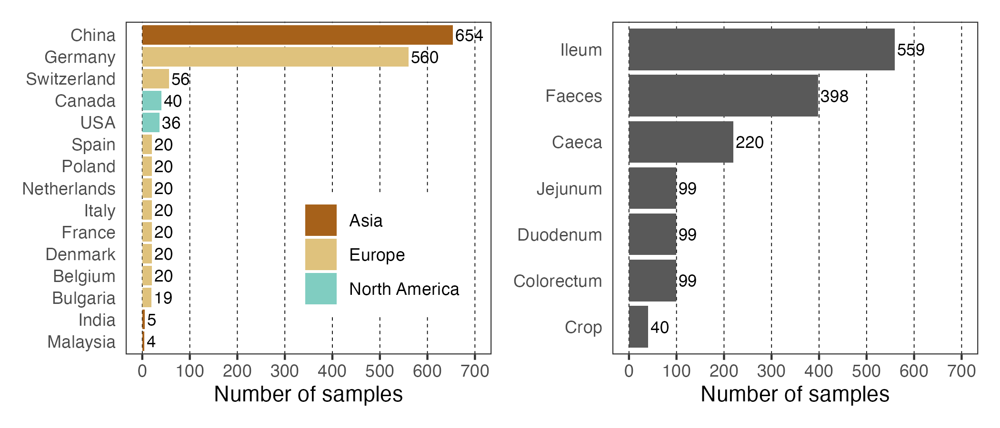

# Diversity of phages in the chicken gut

This repository contains the supporting code for the manuscript **"A metagenomic collection of 19,778 viruses reveals the diverse virome of the chicken gut"**

Johan S. Sáenz^1,2^, Timur Yergaliyev^1,2^, Bibiana Rios-Galicia^1,2^, Jana Seifert^1,2^ & Amélia Camarinha-Silva^1,2^

^1^Institute of Animal Science, University of Hohenheim, Emil-Wolff-Str. 6-10, 70593 Stuttgart, Germany

^2^HoLMiR—Hohenheim Center for Livestock Microbiome Research, University of Hohenheim, Leonore-Blosser-Reisen Weg 3, 70593 Stuttgart, Germany

You can read the preprint here: https://www.researchsquare.com/article/rs-6671648/v1

## Data availability

The collection of 47,092 viral genomes and the 19,778 dereplicated species-level vOTUs can be found in Zenodo, <https://zenodo.org/records/15063554>. Metagenomic samples used in this study are publicly available and can be downloaded using the provided Bioproject IDs in data folder.

## Sample summary

In total we collected 1,514 chicken gut metagenomic samples from 15 different countries, including samples from faeces and 6 gut regions.



## Workflow

Data was analyse using the High Performance and Cloud Computing BINAC at the Zentrum für Datenverarbeitung of the University of Tübingen, at the state of Baden-Württemberg, Germany.

Bioinformatic tools were installed using Conda or Mamba.

### Table of Contents

1.  [Download metagenomic samples](#download-metagenomic-samples)
2.  [Quality control and host removal](#quality-control-and-host-removal)
3.  [Assembly and filtering](#assembly-and-filtering)
4.  [Virus identification and quality](#virus-identification-and-quality)
5.  [High-quality viral genomes and vOTUs](#high-quality-viral-genomes-and-vOTUs)
6.  [Cluster family and genus](#cluster-family-and-genus)
7.  [Taxonomic annotation](#taxonomic-annotation)
8.  [Predict host and lifestyle](#predict-host-and-lifestyle)
9.  [Map reads](#map-reads)
10. [Functional annotation](#functional-annotation)

------------------------------------------------------------------------

## Download metagenomic samples 

Samples were download using the [SRA-toolkit](https://github.com/ncbi/sra-tools) v3.1.1 and the SRA ID provided in the [metadata data-frame](https://github.com/SebasSaenz/chickenphages/tree/main/data_availability). Requesting more than 1 thread can crash the process.

This pipeline retrieves raw sequencing data from the SRA and converts it to FASTQ format. Prefetch downloads the .sra file to a temporary directory (sra_temp), with integrity verification and a file size limit of 50 GB. fasterq-dump converts the .sra file into paired-end FASTQ files, saved in fastq_files.

```         
prefetch \
  SRR12345678 \
  -O sra_temp \
  --verify yes \
  --max-size 50G
  
fasterq-dump \
  sra_temp/SRR12345678 \
  --split-files \
  --outdir fastq_files \
  --threads 4
```

## Quality control and host removal

This step assess read quality, trim low-quality bases and adapters, and remove host-derived sequences using the reference genome.

```         
# Generates a comprehensive report on the quality of raw reads (e.g., per-base quality, GC content, duplication levels).

fastqc \
  -q \
  -t 4 \
  -o out_dir \
  -f fastq \
  reads/sample_R1.fq.gz \
  reads/sample_R2.fq.gz
  
# Creates an index from the host reference genome for downstream alignment and filtering.

bowtie2-build \
  --threads 8 \
  reference_genome.fasta \
  index/host
  
# Removes adapters and trims low-quality bases from both ends of paired-end reads.

trim_galore \
  --paired \
  -j 4 \
  reads/sample_R1.fq.gz \
  reads/sample_R2.fq.gz
  
# Aligns trimmed reads to the host genome. Only unmapped reads (i.e. likely microbial or viral) are retained for downstream analysis.

bowtie2 \
  -p 8 \
  -x index/host \
  -1 out_dir/sample_val_1.fq.gz \
  -2 out_dir/sample_val_2.fq.gz \
  --un-conc-gz out_dir/no_host \
  > out_dir/host.sam
```

## Assembly and filtering

This step assemble metagenomic reads and filtered out short contigs that are typically less informative for downstream analyses like binning, annotation, or viral detection.
```         
# Uses MEGAHIT to assemble high-quality paired-end reads into contigs using parameters optimized for complex microbial communities.

megahit \
  -1 clean_reads/sample_R1.fq.gz \
  -2 clean_reads/sample_R2.fq.gz \
  -o megahit_results/sample_001 \
  -t 8 \
  --presets meta-sensitive
  
# Removes contigs below 5,000 bp using bbduk.sh to retain higher-confidence scaffolds for further analysis (e.g. viral prediction, binning).

bbduk.sh \
  in=megahit_results/sample_contigs.fasta \
  out=filtered/sample_filtered.fasta \
  minlen=5000
```

## Virus identification and quality

This step describes how viral sequences are predicted from metagenomic assemblies and assessed for completeness and contamination using geNomad and CheckV.
```         
# Runs the full geNomad pipeline to identify viral genomes and MGEs from filtered contigs.

genomad end-to-end \
  --cleanup \
  --conservative \
  assemblies/sample_filtered_contigs.fasta \
  genomad_output/sample \
  /path/to/genomad-db \
  --threads 16

# Evaluates the completeness, contamination, and host contamination of viral genomes.


checkv end_to_end \
  viral_contigs/ \
  checkv_output/ \
  -t 18 \
  -d /path/to/checkv-db
```

## High-quality viral genomes and vOTUs

This section describes the steps to filter high-quality viral genomes and cluster them into viral Operational Taxonomic Units (vOTUs) based on pairwise nucleotide similarity.

Scripts to cluster the viral genomes at 95% ANI and 85% min-coveerage can be found in : <https://github.com/snayfach/MGV>

--min_ani 95: defines vOTUs based on ≥95% nucleotide identity
--min_tcov 85: subject genome must be ≥85% covered
--min_qcov 0: no coverage threshold for the query genome (relaxed for inclusivity)

```         
# Extracts contigs that meet predefined quality thresholds (e.g., ≥50% completeness) based on CheckV results.

seqkit grep \
  -n \
  -f ids.txt \
  contigs.fasta \
  > filtered_contigs.fasta

# Creates a nucleotide BLAST database from the filtered viral contigs.

makeblastdb \
  -in contigs.fasta \
  -dbtype nucl \
  -out blast_db/contigs_db

# Computes pairwise nucleotide similarity between viral genomes.

blastn \
  -query viral_contigs.fasta \
  -db blast_db/nt \
  -outfmt '6 std qlen slen' \
  -max_target_seqs 10000 \
  -out results/blast_hits.tsv \
  -num_threads 20

# Computes Average Nucleotide Identity (ANI) from the BLAST output.

anicalc.py \
  -i blast_hits.tsv \
  -o ani_summary.tsv

# Clusters genomes based on ANI and coverage thresholds using aniclust.py.

aniclust.py \
  --fna genomes/fna_files \
  --ani ani_summary.tsv \
  --out clustering_results \
  --min_ani 95 \
  --min_tcov 85 \
  --min_qcov 0
```

## Cluster family and genus
This section describes the steps to compute Average Amino Acid Identity (AAI) between viral genomes and cluster them into genus-level groups using the Markov Clustering algorithm (MCL).

This script filters AAI-based pairwise comparisons to retain only those with sufficient biological similarity. It is useful for defining genome clusters or taxonomic thresholds based on shared protein content and identity. Script can be found in : <https://github.com/snayfach/MGV>

```         
# Builds a DIAMOND-formatted protein database from viral protein sequences.

diamond makedb \
  --in proteins.faa \
  --db diamond_db/protein_db \
  --threads 10
  
# Aligns viral proteins against the database to generate pairwise comparisons for AAI calculation.

diamond blastp --query %s \
               --db %s \
               --out %s.tsv \
               --outfmt 6 \
               --threads 20 \
               --evalue 1e-5 \
               --max-target-seqs 10000 \
               --query-cover 50 \
               --subject-cover 50
               
# Processes BLAST output to compute Average Amino Acid Identity between genomes.

python amino_acid_identity.py \
  --in_faa proteins/sample.faa \
  --in_blast blast_results/sample_vs_db.tsv \
  --out_tsv results/aa_identity.tsv
  
# Filter edges and prepare MCL inputs GENUS

python filter_aai.py \
  --in_aai results/aa_identity.tsv \
  --min_percent_shared 20 \
  --min_num_shared 16 \
  --min_aai 40 \
  --out_tsv results/aa_identity_filtered.tsv

# Runs MCL on the filtered similarity matrix to define genus-level genome clusters.

mcl similarity_matrix.txt \
  -te 8 \
  -I 2.0 \
  --abc \
  -o mcl_clusters.txt
```

## Taxonomic annotation

This step annotates filtered viral contigs using the geNomad annotate module, providing gene predictions, functional annotations, and taxonomic classifications. --lenient-taxonomy: avoids pipeline interruption due to uncertain or unclassified taxonomic assignments

```         
genomad annotate \
  --cleanup \
  --lenient-taxonomy \
  filtered_viral_contigs.fasta \
  annotation_results/ \
  /path/to/genomad-db \
  --threads 16
```

## Predict host and lifestyle


These steps use iPHoP to predict bacterial hosts for viral contigs, and BACPHLIP to infer viral lifestyles (lytic vs temperate). Splitting the dataset allows parallel or distributed prediction.
```         
# Splits a multi-FASTA file into smaller contig files.

iphop split \
  --input_file viral_contigs.fasta \
  --split_dir split_contigs/
  
# Runs host prediction for batch files against the iPHoP database.

iphop predict \
  -t 20 \
  --fa_file split_contigs/contig_001.fasta \
  --db_dir /path/to/iphop_db \
  --out_dir iphoppredictions/contig_001

# Uses protein content to predict the lifestyle of each phage.

bacphlip -i %s --multi_fasta
```

## Map reads

Maps metagenomic reads to viral contigs and calculates normalized abundances.

--methods rpkm: calculates Reads Per Kilobase per Million mapped reads
TMPDIR=. ensures temp files stay in current directory (useful on shared clusters)
Filters ensure only high-confidence mappings are considered
```         
TMPDIR=. coverm contig \
  --methods rpkm \
  -t 14 \
  -c assemblies/contigs.fasta \
  alignments/sample.bam \
  -r assemblies/contigs.fasta \
  -o coverage/sample_rpkm.tsv \
  --min-read-percent-identity 90 \
  --min-read-aligned-percent 75 \
  --min-covered-fraction 75
```

## Functional annotation

This steps predicts and functional anotate the genes from phages using a database tailored for viral genomes.
Additionally, DefenseFinder is useto give genomic context and type of detected bacterial defense systems in the phages.
```
# Runs gene prediction and functional annotation on phage contigs using a database tailored for viral genomes.

pharokka.py \
  -i phage_contigs.fasta \
  -o pharokka_output \
  -d /path/to/pharokka_db \
  -g prodigal-gv \
  -m \
  -t 14

# Scans contigs for known anti-phage defense systems (e.g., CRISPR, BREX, DISARM).

defense-finder run \
  assemblies/contigs.fasta \
  -o defense_results/ \
  -a
```
